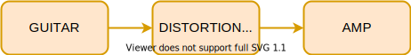
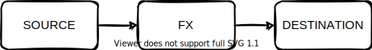

# 0.0 Introduction

Hello all, this is Webaudio. We will discuss what is internet and how we can interpret and rebuild it from a musical perspective, and how to transform the browser into a  transmodal musical instrument.

This course dives deeply into the design and implementation of web apps, having an overall understanding of computing, internet philosophy and networked orientated musical thinking. On the technical aspects we will discuss some problems of programming pattern design and its implementations in JavaScript, Python, Databases languages and frameworks as SQL, Django, React, and Bootstrap. Also we will take a close look to the basics principles of WWW, html , css and the potential of structural web page creations.

Our sandbox will be online editors as the Cloud IDE [repl.it](http://repl.it), version control systems as Git and it's modern version Github, tools that we can use to keep track of changes we make into code, and also to collaborate between each-others in realtime.

We'll also dive into Python, Google Colab, the foundations of machine learning and artificial intelligence applied to music production, and CAC. 

Although one of our main goals is performatic and aesthetic, we will introduce subjects dealing with best practices in the web as testing,  more complex principles as CI/CD (continuous integration / continuous delivery), scalability and security as we build an emergent idea from composing a piece into the browser, to the fact  of considering internet as the ground for a work of art. 

Along the way you will have the opportunity to put all of each content into practice by building snippets of your very own.

so , Welcome to Web-audio at HEM. 

# 0.1 hello world: The AudioContext()

1. The audio context is an object that will contain everything related to web audio. It's similar to the concept of canvas in js and in puredata.  Technically speaking is an instance that start a thread (a memory allocation on the RAM of the microprocessor being evaluated continuously).
2. AudioContext is an audio node-graph:



- For example, you play the guitar, and you have an amp, well, the guitar is a source, and the amp is the destination.
- But then you add a dist pedal, an eq, and a reverb pedal.
- This chain of source audio plus FX that modify the sound is what is called a "node graph".
- Each component is a **node.**
- We start with a **source node (**a guitar, a saw wave, a sample), then we interpose a node (a fx, a process), and end with a  **destination node (**speakers, re-router, any type of output).

 


    1. It’s not considered a good practice to have more than one audio context in a single project.

## new AudioContext()

1. about:blank ← on the browser

```jsx
//OPEN JAVA CONSOLE
caJ //Chrome, 
caK //Firefox, 
oL //Firefox erase Console
cK //Chrome erase Console

//1
var audioContext = new AudioContext();
var osc = audioContext.createOscillator();
osc.connect(audioContext.destination);
osc.start();
osc.stop();

//2
var vol = ctx.createGain();
var audioContext = new (window.AudioContext || window.webkit.AudioContext);
vol.connect (audioContext.destination); //connect the node vol with the Audiocontext
osc.connect(vol);
vol.gain.value=0.02;

```

```jsx
new AudioContext()

//it shows the parameters (sampleRate, Destination,. listener) of the AudioContext of the browser.
// values can be simple/primitive values
// destination: where the propertie is your soundcard, values are the properties of the soundcard. 
Primitives are numeric values , non-primitives are objects that have embedded properties. 

//__proto__ 

is a non-primitive object that have a lot of different actions (also called methods) 
when you see a *f* that means *functions (functions and methods in this case can be synonimous).
But what is a function, is an action that I can use this function anytime we want. 

so an AudioContext is an object with methods and functions.* 

```

```jsx
var context = new AudioContext(),
        oscillator = context.createOscillator();
        oscillator.connect(context.destination);
        oscillator.start(context.currentTime);

        // You can see we’ve passed context.currentTime here. This means we are telling the browser to start the oscillator now. To stop it, we simply say this:
        oscillator.stop(context.currentTime + 1);

```

Oscillators, by design, are only able to be started and stopped exactly once. Think of them as some sort of weird audio firework. This is actually better for performance, because it means they won’t be hanging around in memory waiting to be used when they don’t need to be. Luckily, oscillators are cheap and easy to make, so we’ll create one every time the user holds down the mouse button.

# 0.2 my first webmusic app 40'

```jsx
//embedding a button

```

# Summary 0

🚧 ALL COURSE CODE

As you could see, there are some characteristic of webaudio and internet music that we can start to organize , in order to make a more clear step learning focused into music and not into the generality of programming. 

- music Technology and web music **[WMUSIC]**
    - in this area we will focus on the specific method of audio **[WEBAUDIO]** and music technology including the apis of WebAudio, scores, and code paradigyms glue to musical thinking.
    - For the specificities of each language and script we will use the tags **[JS], [HTML], [CSS]** and so on.
- User Design , GUI and DOM **[ITF]**
    - here we will deal with both the interaction and the visualiztion or modal output of information.
    - Mostly is a local (first user) content.

- Coding philosophy and Internet Music **[FIM]**
    - here we will think of what it can be done with internet, and its more important components.
    - Also we will deal with the remoteness, and the data access posibilities.

# 0.1 WebAudio [WMUSIC]

There three type of audio nodes, 

1. The **Source Node** [produces sound]
2. The **Processing Node** [process sound]
3. The **Destination Node** [creates and render the audio]

### webaudio api

To understand the Web Audio API, you must first understand what an API is . API stands for application programming interface . An API is a portion of code that a programmer is given access to, which controls a larger unseen body of code within certain constraints . Imagine if, in order to learn how to play your favorite musical instrument, you had to literally build it from scratch . As you can imagine, this would get very tedious—especially if the instrument were to break . Thus, it’s much more convenient to learn to play a premade musical instrument . The convenience here is that the construction process is removed and your only concern is what is important to you, which is the controls needed to use the instrument . In a similar manner, programmers write APIs that expose only small pieces of code for developers to use, and these small pieces of code allow you to do a lot of work with minimal effort .

In addition to being able to load and play back sound files, the Web Audio API also allows you to generate sound from scratch in the form of oscillators . You can then manipulate any sound playback or generation using filters, reverb effects, dynamic compressors, delay effects, and a host of other options .

### Some characteristics of Web Audio API

1. Web Audio API is a native JavaScript library for advaed audio processing.
2. Allows to access to features as sythesis, analysis, visualization, spazialtion and time-based performances.  
3. The easiest helloworld flowchart is to create an AudioContext which is a method of the **window** object.

    ```jsx
    new (window.AudioContext || window.webkitAudioContext)();
    ```

```jsx
//a basic connection

const context = new AudioContext(), osc = new OscillatorNode(context), amp = new GainNode (context, {gain:0.5});
osc.connect(amp).connect(context.destination);
osc.start();

```

But this won't work on many browsers due a limitation introduced in 2018 by Google Chrome:

The user gestures are required for the browser tab, so as minimum I need to create a button to play the audio context when its pressed.

```jsx
window.addEventListener('load', () => {

  const button1 = document.getElementbyId("start");
  button1.disable = false;
  button1.addEventListener ('click', () => context.resume());

})
```

## AudioBuffer

```jsx
const playSample = (audioBuffer, audioContext) => {
	const bufferSource = 
		new AudioBufferSourceNode(audioContext, {buffer: audioBuffer});
  const amp = new GainNode (audioContext);
  bufferSource.connect(amp).connect(audioContext.destination);
  bufferSource.start();
```

To grant separability is useful to construct the audio nodes inside variables .

Here we're passing the buffer (audioBuffer) to create a buffer source (the bufferSource)

Then we connect the bufferSource (a private node) to the amp (the process node) and the amp to the destination./

```jsx
class Pad {
    constructor (outputNode, audioBuffer) {

      this._context = outputNode.context;
      this._buffer = audioBuffer;
      this._outputNode = outputNode;
    }
  }
```

Finally we add a sample method , almost the same than the prior function.

But with one differences, that we're now referring to objects store on this variable 

```jsx
playSample () {
	const bufferSource = 
		new AudioBufferSourceNode(this._context, {buffer: this._bufffer});
  const amp = new GainNode (this._context);
  bufferSource.connect(amp).connect(this._outputNode);
  bufferSource.start();
}

```

# 0.2 Work-Enviroment [ITF]

## 0.2.1 browser

Accessing Developer Tools

```jsx
//OPEN JAVA CONSOLE

CHROME and CHROMIUM BASED (brave, vivaldi, edge, opera, torch)
caJ //open java console
cK //Chrome erase Console

csM // Switch to Mobile Preview View
csC // Inspect CSS HTML elements on the preview

FIREFOX (QUANTUM GECKO BASED)
caK //Firefox, 
oL //Firefox erase Console

```

### js strict mode

- Strict mode makes it easier to write "secure" JavaScript.
- Strict mode changes previously accepted "bad syntax" into real errors.
- As an example, in normal JavaScript, mistyping a variable name creates a new 
global variable. In strict mode, this will throw an error, making it impossible 
to accidentally create a global variable.
- In normal JavaScript, a developer will not receive any error feedback 
assigning values to non-writable properties.
- In strict mode, any assignment to a non-writable property, a getter-only 
property, a non-existing property, a non-existing variable, or a non-existing 
object, will throw an error.

```jsx
// Whole-script strict mode syntax
'use strict';
var v = "Hi! I'm a strict mode script!";
```

## Text Editors

### Local IDE and Cloud IDE.

LOOKINF FOR HELP?

[http://stackoverflow.com](http://stackoverflow.com) is one of the biggest communities of programmers who ask and answer questions. 

go to [http://stackoverflow.com/questions/tagged/web-audio](http://stackoverflow.com/questions/tagged/web-audio)  for audio related questions.

# 0.1 Javascript [JS]

1. multipurpose programming language initially created to aid developers in adding dynamic features to websites like animations and manipulations of the browser document object model (DOM). It was created in 11 days and released in 1995 by Netscape, one of the first browsers of history (Brendan Eich, first named LiveScript)
2. html stands for hypertext markup language , is the standard by which we create documents for the WWW. You program HTML by writing elements or tags. 
3. CSS stands for cascading style sheets and is a tool used to modify how HTML elements and text are presented. 
4. In a very loose comparision, JS and CSS could be related to the Orchestration or Material Disposition of a Musical Score, or Csound patch, meanwhile HTML is the time and content organization presented in the Score.
5. JS is used to add interactivity and interconnectivity to HTML. Its most important concepts are canvas, DOM, OOP and extensivity through libraries. 
6. Node.Js is introduced in 2009 (Ryan Dahl) , transfering the power of JS to the backend (the server side of the web) and generalizing JS in so much platforms as the most deployed programming language in history. 
7. The big difference is that js is a not compiled language that can outperform Python and in some cases even to C++ thanks, most prominently, to the V8 JavaScript engine, wich does just-in-time compilation, inlining and dynamic code optimization.

### properties

1. Properties are the values associated with a JavaScript object.
2. A JavaScript object is a collection of unordered properties.
3. Properties can usually be changed, added, and deleted, but some are read only.

```jsx
objectName.property      // person.age

//add
person.nationality = "English";

//define
const person = {
  firstName: "John",
  lastName: "Doe",
  age: 50,
  eyeColor: "blue"
};

//delete
delete person.age;

//nested
myObj = {
  name:"John",
  age:30,
  cars: {
    car1:"Ford",
    car2:"BMW",
    car3:"Fiat"
  }
}

myObj.cars.car2;
```

### methods

1. JavaScript methods are actions that can be performed on objects.
2. A JavaScript **method** is a property containing a **function 
definition**.

```jsx
const person = {
  firstName: "John",
  lastName: "Doe",
  id: 5566,
  fullName: function() {
    return this.firstName + " " + this.lastName;
  }
};

//accessing
objectName.methodName()

//example
name = person.fullName();
```

If you access the fullName property, without (), it will return the function definition:

```jsx
name = person.fullName;
```

```jsx
//add method
person.name = function () {
  return this.firstName + " " + this.lastName;
};

//built-in methods
let message = "Hello world!";
let x = message.toUpperCase();
```

### DOM

The DOM (Document Object Model) is a collection of JS properties and methods that allows you to manipulate HTML elements to respond to user interactions.

In interactivity technique there are two useful questions:

1. What do you want the user to do?
2. What should happen in response to user action?

Lets see a hello world example for DOM:

```jsx
<body>
	<input id="play-btn" type="button"> value="PLAY">

<script>
window.onload = function() {   //restricts the code in the function scope untill all HTML has loaded.
var playButton = document.getElementById ("play-button"); //select 
playButton.addEventListener ("click", function() {
console.log ("CLICK");
//alert ("CLICK");
});
};
</script>

</body>
```

### elements

1. “Element” is the official name for a node of a HTML document. For example, <p>something</p> is a string representation of a HTML element.
2. type of elements

```jsx
//ID
const element = document.getElementById("intro");

//TAG NAME
const element = document.getElementsByTagName("p");
const x = document.getElementById("main");

//CLASS NAME
const x = document.getElementsByClassName("intro");

//CSS SELECTORS
const x = document.querySelectorAll("p.intro");
```

# 0.2 Introduction to GUI [ITF]

## CSS and responsive design

1. Responsive design is all about making sure that our web can fit and adapt , no matter how you're using or looking at the web page. 
2. Nowadays, we design a page not only for a desktop computer.
3. Is important 
4. We will look for the principles needed in order to implement responsive design in our projects:
    1. viewport
    2. media queries
    3. flexbox
    4. grids.

### Viewport

- Is the visual part of the screen that user actually sees and interact with.
- What happens when a page prepared to be used in a 1980x1000 px screen is used in a mobile phone?
    - One possible strategy is to shrink it down to fit onto a mobile screen.
    - But this is not the best solution. We want our app to adapt todifferent sized screen and angles.
    - We have a simple way to do this adding a little HTML element inside the head section of our page that contrls the viewport:
    - 

    ```html
    <meta name="viewport" content="width=device-width, initial-scale=1.0">
    ```

### Media queries:

- Media queries is all about controlling how our page is going to look depending on how we render that particular page:

    

```css
@media (min-width: 600px) {
            body {
                background-color: red;
            }
        }
        @media (max-width: 599px){
            body {
                background-color:blue;
            }
        }
```

- You cannot only control the background color, you can even hide elements on smaller screens if you want to by using a particular CSS property called the display property.
- And we can se whether a mobile device is vertical or landscape.
- Also we can detect wheter an user is watching a page on a screen or is trying to print-out the page.
- So there are many media queries to control how a page is going to look:
    - breakpoints:

        Breakpoints are maybe the most common term you will hear and use. A breakpoint is a key to determine when to change the layout and adapt the new rules inside the media queries. Let’s go back to our example at the beginning:

        ```css
        @media (max-width: 480px) {
          .text {
            font-size: 16px;
          }

        ```

        - common break-points

    - all — for all media types
    - print — for printers
    - screen — for computer screens, tablets and, smart-phones

        ```css
        @media screen and (max-width: 480px) {
          .text {
            font-size: 16px;
          }
        }
        ```

    - speech — for screen readers that “read” the page out loud

### Flexbox

This is one of the lastest tools in CSS to answer to responsiveness needs.

- Flexbox allow to organize many objects when we are trying to display on the same page at the same time that might overflow if we're not careful about how we do responsive design.
- The best option in between many others, flexbox helps to wrap around objects: change the quantities between rows and columns elements.

### Grids

[Layoutit Grid - CSS Grids layouts made easy!](https://grid.layoutit.com/)

## HTML elements

### canvas

The HTML `<canvas>` element is used to draw graphics on a web page.

The graphic to the left is created with `<canvas>`. It shows four 
elements: a red rectangle, a gradient rectangle,
a multicolor rectangle, and a multicolor text.

```jsx
<canvas id="myCanvas" width="200" height="100"></canvas>

<canvas id="myCanvas" width="200" height="100" style="border:1px solid #000000;">
</canvas>

//draw circle
<script>
var c = document.getElementById("myCanvas");
var ctx = c.getContext("2d");
ctx.beginPath();
ctx.arc(95, 50, 40, 0, 2 * Math.PI);
ctx.stroke();
</script>

//draw text
<script>
var c = document.getElementById("myCanvas");
var ctx = c.getContext("2d");
ctx.font = "30px Arial";
ctx.fillText("Hello World", 10, 50);
</script>

//draw line
<script>
var c = document.getElementById("myCanvas");
var ctx = c.getContext("2d");
ctx.moveTo(0, 0);
ctx.lineTo(200, 100);
ctx.stroke();
</script>
```

### canvas vs svg

**CANVAS**

- Resolution dependent
- No support for event handlers
- Poor text rendering capabilities
- You can save the resulting image as .png or .jpg
- Well suited for graphic-intensive games

**SVG**

- Resolution independent
- Support for event handlers
- Best suited for applications with large rendering areas (Google Maps)
- Slow rendering if complex (anything that uses the DOM a lot will be slow)
- Not suited for game applications

### WebGL

# 0.3 Webmusic  [FIM]

## Webmusic is a case of  Generative music

### What does listening to Generative Music mean?

1. First hypothesis: we don't know what is generative music because the most important pieces already didn't happen.
2. Generative Music can be only produce by means of free software.
3. On the times of Illiac Suite (Hiller and Issacson) the mediation of the music to be listen included a recording or an orchestra. Is not essencially generative.
    1. Generation and sound realization are synchronic.
    2. So Instantiation of Generative Music can be realted to the computational powers of each age.

## The destination: Living in a pre tangible internet era.

### Tangibility: IOTT

With the rise of new media and digital art,there are many different trends to
bring the conversation of art and technology back to the body. Works that advocate for involve the body on a deeper level and invoke our
senses, playful and engaging;  interacting  with us.

Other "destination" latent posibilities
