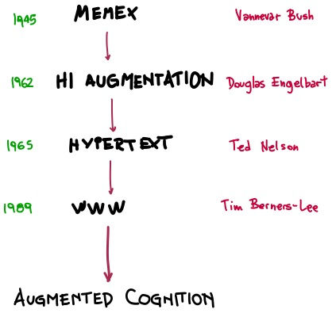

# Writing in Internet: an introduction

The deployment of music notation tools on the Internet has been investigated since the late 1990s. A first example can be the [Guido Note Server](https://guidoeditor.grame.fr). After a large number of applications, we can mention MuseScore, which also is an open-source community sharing their scores on the Internet. Noteflight, Scorio, LilyBin, and the GuidoEditor. All these systems are based on the traditional music notation, not dealing with any problems or paradigms of the networked performances possibilities.

On this late possibilities, the work of Georg Hajdu [Quintent.net](http://quintent.net) is worth to mentioning, although still based on local Maxmsp patches and symbolic notation.

Another example is the Decibel Score Player, based on graphical notation. It allows for the synchronization of the scores of a performing ensemble. In this case, is a standalone app on the ipad.

[Decibel ScoreCreator - Decibel](https://decibelnewmusic.com/decibel-scorecreator/)

SmartVox uses a st.andard browser to distribute, synchronize music scores, and audio signals.



### Paradigms

But before we get into the specifics, let's review some milestones of writing as a phenomenon from the perspective of the internet. What are the changes it introduced, not only in formats, but in styles, thought processes and reception.

Mark Bernstein in 1998, is one of the first writers to think of the hyperlink as a literary device. [Hypertext Gardens](http://www.eastgate.com/garden/Enter.html) appears to be the first recorded mention of a phenomenon of the the third decade of '21: the [digital gardens](https://www.technologyreview.com/2020/09/03/1007716/digital-gardens-let-you-cultivate-your-own-little-bit-of-the-internet/). They are not blogs, not final articles, no medium. A kind of work-in progress personal wiki that eventually can be a basis of datasets construction. Usually is also associated to the concept of pruning or defragging information.

Bernstein’s ideas were in sync with a larger discussion happening throughout the nineties around the metaphorical framing of hyperlink. Between the pick-your-own-path and the signposts resources , this debate became known as The Navigation Problem, and deals with concepts of freedom, guidance, auto-learning and browsing experiences. A balance between chaos and structure, as usual.

[chasing our tails](http://www.eastgate.com/tails/Welcome.html) (1997, Mark Bernstein) an early example of hyperlink literature.

All these subjects are too big to be explored in this class of “internet musical writing”, but they are essential on the development of a cross-border field between writing, thinking frameworks, language creation, networking performance, and a lot of very dynamic ideas around them. Here a very initial list of things to know:

1. **bidirectional linking** - (Bush, 1945) memex machine, the total document organized by indexes.
2. **second brain** and digital life:
   * obsidian, notion, tiddlywiki, mediawiki
   * IRL, PARA(Projects, Areas, Resources, and Archive)
3. **pattern language**
   * **topography over timeline** (information is connected to other through related themes(bi-directional linking, breadcrumb), topics(tags), and shared context (folders).
     * Tagging is also an internet science:
       * preference of associative ontologies (emerging tags) to hierarchical taxonomies.
   * **continuous growth**
     * a cultural object is not anymore a static piece but a growing topic-space with editability, performability, collaborative and version tracking.
     * idea to fuzzy logic to thinking pattern to pattern recognition → shareable epistemology → exorganology → networked music.
     * like-comment culture → imperfection → learning in public
   * **writing style**
     *   structural reading:

         * structural levels high to low: title, metadata block, abstracts, section headers, margin notes, emphasized keywords in list items, footnotes/sizenotes, collapsed sections, internal cross-referencing (or popping up)
         * constrained text size and reading time visualization.
         * tree structure and sidenotes.
         * progressive exposition (code folding)

4. **new format paradigms**
   * **mnemonic medium** (a media that makes users to remember what they read → auto-grading) ex: anki, quizlet, duolingo, memrise, srm systems.
   * **mnemonic video**
   * **executable books** → [jupyter](https://executablebooks.org/en/latest/gallery.html) / google colab / github ([ex](https://mitpress.mit.edu/sites/default/files/titles/content/sicm\_edition\_2/book.html), [Ex](https://github.com/norvig/pytudes/blob/master/ipynb/Economics.ipynb))
   * **dynamics music scores**


Gwern Branwen is one of the earliest digital gardens, gwern.net\
\
All these have also links to a new science of the scientific paper, js-free latex rendering, disqus comment, reference managers (**mendeley**, **zotero**, **paperbox**) and automatic link-ification.


