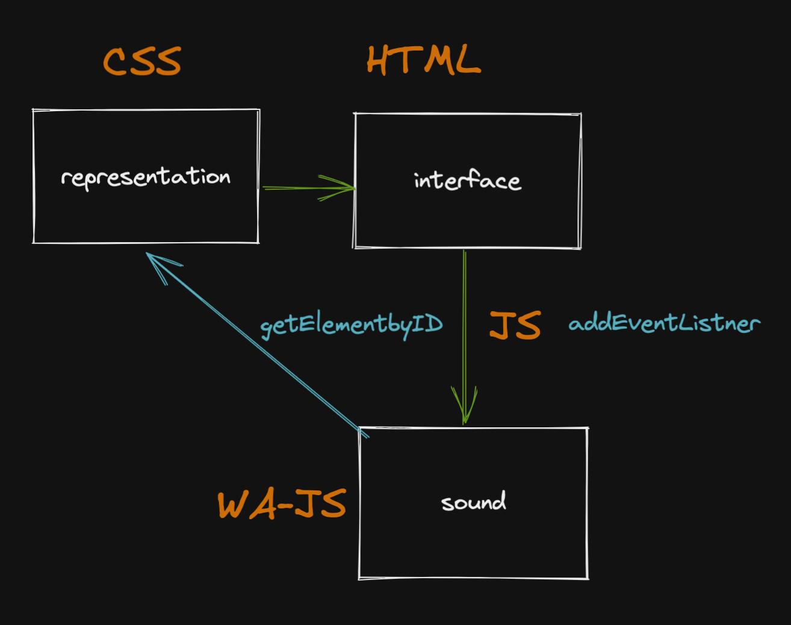

# generators

So let's create our first instrument.


Make a simple instrument with performative-interaction and WA Generators\
\
remember these two programming-flow questions:\
**1. What I want the performer do?,**&#x20;

**2. What happens with that action?**&#x20;


1. As an initial formula, we can summarize that a web instrument consists of a **representation**, an **interface**, and a **sound** action.
2. In the beginning, the representation and the interface will be the same object.&#x20;
3. Each stage will have a specific code and specific bindings between them.&#x20;
4. Along the way, we will start from a very raw code, to understand the fundamentals of JS, which will become more synthetic and encapsulated with the use of libraries.&#x20;



5.For representation-interface we will use the \<button\</button> HTML element

6.For binding the buttons to JS we will use the method:

```
document.getElementById("kick")
```

7\. To listen to user interaction:

```
<buttonTarget>.addEventListener ("click", () => { <codeToPlay> })
```

This is a tricky step. The method addEventListener triggers an arrow [function](../javascript/js-functions.md) that is  called whenever the event is delivered. The definition of the event is  the`"click"` part of the code. So the basic syntaxis is:

```
addEventListener(type, function);
```

8\. Inside the addEventListener triggered function the WA code is hosted.&#x20;

9\. Finally we set a list of generators: sine oscillator, square oscillator, a whitenoise buffer being played in two instances, and a bassdrum emulator made of a freq-ramp-oscillator.




&#x20;
